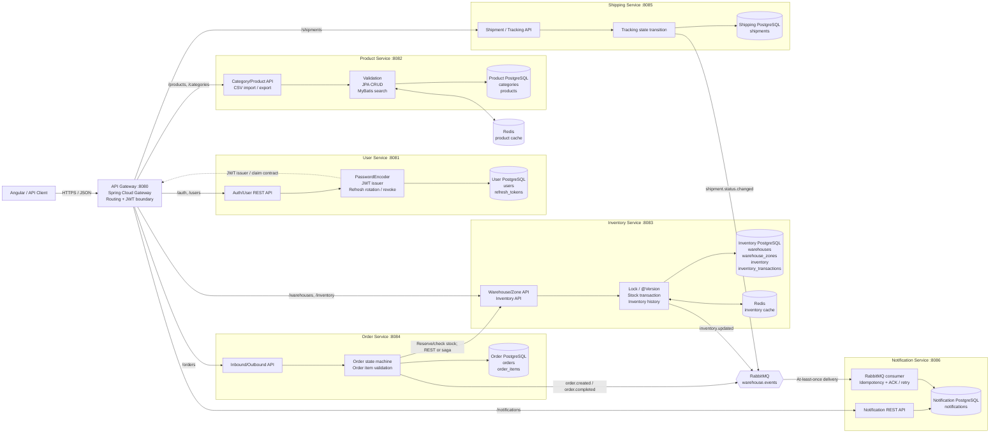
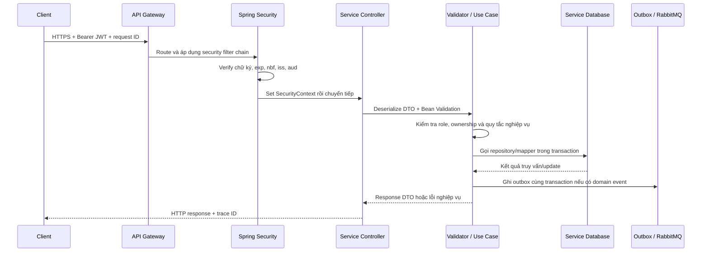
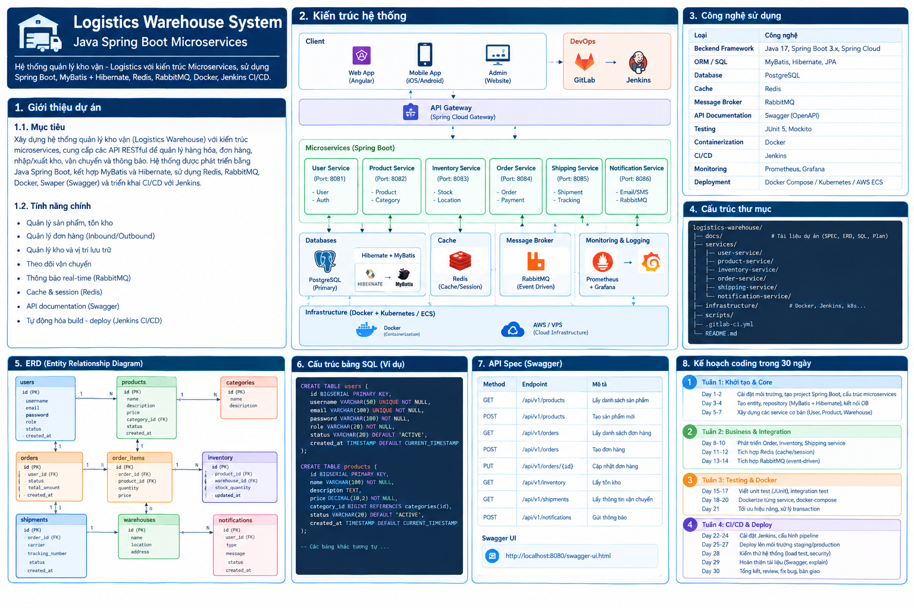
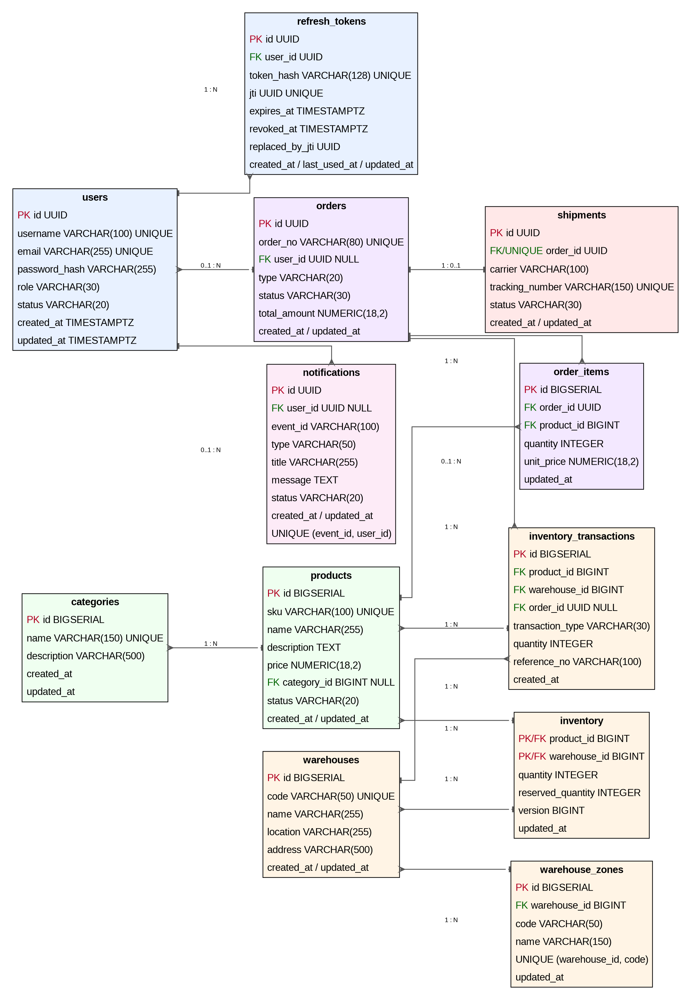

# Logistics Warehouse — Java Spring Boot

## 1. Giới thiệu

**Logistics Warehouse** là backend quản lý kho theo kiến trúc microservices. Dự án hướng tới luồng nghiệp vụ từ quản lý tài khoản, catalog, kho/tồn, đơn nhập-xuất đến shipment và notification.

Các service được thiết kế bằng Java 17/Spring Boot, giao tiếp đồng bộ qua REST và bất đồng bộ qua RabbitMQ. Mỗi service sở hữu dữ liệu thuộc bounded context của mình; không truy cập trực tiếp bảng của service khác.

> Workspace hiện là scaffold tài liệu: thư mục service chưa có controller/entity và chưa có Gradle Wrapper. Các API, quy trình build và deployment trong tài liệu là hợp đồng mục tiêu để triển khai.

## 2. Mục tiêu

- Thiết kế REST API có request/response DTO, validation, phân trang và hợp đồng lỗi rõ ràng.
- Dùng PostgreSQL làm nguồn dữ liệu chuẩn; phân biệt Hibernate/JPA và MyBatis theo loại truy vấn.
- Bảo vệ API bằng Spring Security, JWT access token, refresh token rotation và RBAC.
- Bảo toàn tồn kho bằng transaction, khóa/version và inventory transaction history.
- Dùng Redis cho cache có TTL/invalidation; dùng RabbitMQ cho domain event và notification.
- Kiểm thử bằng JUnit 5, Mockito, Spring Boot Test và Testcontainers.
- Đóng gói WAR bằng Gradle, chạy trên Tomcat ngoài/container, triển khai qua Jenkins.

## 3. Kiến trúc



### Ranh giới từng service

| Service              | Route chính                                        | Port | Module/nghiệp vụ                                     | Database sở hữu                                                              |
| -------------------- | --------------------------------------------------- | ---: | ------------------------------------------------------ | ------------------------------------------------------------------------------ |
| API Gateway          | `/api/v1/**`                                      | 8080 | Định tuyến, xác thực biên, trace/correlation     | Không có DB nghiệp vụ                                                      |
| User Service         | `/api/v1/auth/**`, `/api/v1/users/**`           | 8081 | BCrypt, login, JWT, refresh rotation, logout, role     | `users`, `refresh_tokens`                                                  |
| Product Service      | `/api/v1/products/**`, `/api/v1/categories/**`  | 8082 | CRUD catalog, search, import/export CSV                | `products`, `categories`                                                   |
| Inventory Service    | `/api/v1/warehouses/**`, `/api/v1/inventory/**` | 8083 | Kho/zone, điều chỉnh tồn, locking/version, history | `warehouses`, `warehouse_zones`, `inventory`, `inventory_transactions` |
| Order Service        | `/api/v1/orders/**`                               | 8084 | Đơn nhập/xuất, kiểm tra state transition          | `orders`, `order_items`                                                    |
| Shipping Service     | `/api/v1/shipments/**`                            | 8085 | Tạo shipment, tracking và trạng thái vận chuyển  | `shipments`                                                                  |
| Notification Service | `/api/v1/notifications/**`                        | 8086 | Consumer RabbitMQ, đọc/đánh dấu notification      | `notifications`                                                              |

### Quy tắc phụ thuộc logic

Mỗi service là một ứng dụng Spring Boot/WAR độc lập, có cấu hình, migration, test và database riêng. Quy tắc phụ thuộc logic:

```text
controller -> service/use case -> repository interface -> JPA/MyBatis/procedure adapter -> DB
```

Service/use case điều phối nghiệp vụ và transaction; repository interface tách nghiệp vụ khỏi cách lưu trữ; adapter trong `db/` cài đặt truy cập PostgreSQL. Cấu trúc thư mục vật lý được nhóm theo màn hình/use case ở mục **Cấu trúc thư mục vật lý theo màn hình/use case** bên dưới.

### Module riêng theo service

| Thư mục                 | Module inbound/application                                                        | Adapter outbound và dữ liệu                                                                                                           |
| ------------------------- | --------------------------------------------------------------------------------- | ---------------------------------------------------------------------------------------------------------------------------------------- |
| `api-gateway/`          | Route config, global filter, JWT validation, correlation ID, rate limit nếu bật | REST route tới services; không có JPA entity/repository nghiệp vụ                                                                   |
| `user-service/`         | `auth` (login/refresh/logout), `users`, `roles`, `session`                | `UserJpaRepository`, `RefreshTokenJpaRepository`, JWT issuer, BCrypt, User DB                                                        |
| `product-service/`      | `products`, `categories`, `csv/import`, `csv/export`                      | JPA cho CRUD; MyBatis mapper/XML cho search/report; Redis cache; Product DB                                                              |
| `inventory-service/`    | `warehouses`, `zones`, `inventory`, `adjustment`, `transaction-history` | JPA/locking cho mutation; MyBatis hoặc query adapter cho view/report; gọi`sp_adjust_inventory`; Redis; event publisher; Inventory DB |
| `order-service/`        | `orders`, `order-items`, `state-transition`, `confirm`, `cancel`        | Order JPA repository, Inventory REST client, outbox/RabbitMQ publisher; Order DB                                                         |
| `shipping-service/`     | `shipments`, `tracking`, `status-transition`                                | Shipment JPA repository, RabbitMQ publisher; Shipping DB                                                                                 |
| `notification-service/` | `notifications`, `mark-read`, `mark-all-read`, `event-consumer`           | Notification repository, idempotency store, retry/DLQ configuration; Notification DB                                                     |

Gateway xác thực biên nhưng service vẫn kiểm tra quyền ở use-case boundary. Order Service không truy cập Inventory DB; nó gọi Inventory Service và phối hợp kết quả bằng saga/outbox. Notification consumer chỉ ACK sau khi ghi notification thành công.

### Phân lớp logic

Tham khảo cách chia module nghiệp vụ của kiến trúc NEC, nhưng dùng Spring MVC/Spring Security và không dùng JAX-RS hoặc cơ chế code-generation `fixed/`. Đây là ranh giới trách nhiệm logic; cây thư mục vật lý bên dưới được tổ chức theo màn hình/use case trước.

```text
HTTP request
  -> controller/resource adapter
  -> DTO + validation
  -> service/use case + authorization + transaction
  -> repository port
  -> JPA/MyBatis/procedure adapter
  -> database sở hữu bởi service
```

| Lớp         | Trách nhiệm                                                                           | Không làm                                                    |
| ------------ | --------------------------------------------------------------------------------------- | -------------------------------------------------------------- |
| `service/` | HTTP endpoint, deserialize DTO, Bean Validation, status/response                        | Không viết SQL hoặc chứa transaction nghiệp vụ dài      |
| `ap/`      | Điều phối use case, kiểm tra quy tắc nghiệp vụ, mở`@Transactional`, gọi port | Không phụ thuộc trực tiếp HTTP hoặc MyBatis XML          |
| `db/`      | JPA entity/repository hoặc MyBatis mapper/XML, procedure adapter                       | Không quyết định quyền người dùng hay state transition |
| `common/`  | Cấu hình dùng chung bên trong service, exception, security và trace                | Không chứa nghiệp vụ riêng của feature                   |

Áp dụng cùng khung cho các service khác, thay module theo domain:

| Service                  | Module trong`service/ap/db`                                                                       |
| ------------------------ | --------------------------------------------------------------------------------------------------- |
| `user-service`         | `auth`, `users`, `refresh-session`, `roles`                                                 |
| `product-service`      | `products`, `categories`, `csv-import`, `csv-export`                                        |
| `inventory-service`    | `warehouse`, `zone`, `stock`, `transaction-history`, `event`                              |
| `order-service`        | `orders`, `order-items`, `confirm`, `cancel`, `inventory-client`, `outbox`              |
| `shipping-service`     | `shipments`, `tracking`, `status-transition`, `event`                                       |
| `notification-service` | `notifications`, `mark-read`, `event-consumer`, `idempotency`                               |
| `api-gateway`          | `routes`, `security-filter`, `rate-limit`, `correlation-id`; không có `db/` nghiệp vụ |

### Cấu trúc thư mục vật lý theo màn hình/use case

Trong từng service, nhóm theo màn hình/workflow. Mỗi nhóm đi theo thứ tự **`controller -> service -> repository -> db`**; DTO đặt cùng nhóm, còn cấu hình/bảo mật/tích hợp dùng chung đặt ngoài `screens/`.

```text
inventory-service/src/main/java/com/logistics/inventory/
├── InventoryServiceApplication.java
├── common/
│   ├── config/                    # Spring, DataSource, OpenAPI
│   ├── security/                  # JWT/role mapping
│   ├── error/                     # Exception -> HTTP response
│   └── tracing/                   # Request/correlation ID
├── screens/
│   ├── S07-warehouse-zone/
│   │   ├── controller/WarehouseController.java
│   │   ├── service/CreateWarehouseService.java
│   │   ├── service/ListWarehouseZonesService.java
│   │   ├── repository/WarehouseRepository.java
│   │   ├── db/jpa/WarehouseEntity.java
│   │   └── dto/
│   ├── S08-inventory-lookup/
│   │   ├── controller/InventoryQueryController.java
│   │   ├── service/GetInventoryService.java
│   │   ├── repository/InventoryQueryRepository.java
│   │   ├── db/mybatis/InventoryQueryMapper.java
│   │   ├── db/mybatis/InventoryQueryMapper.xml
│   │   └── dto/
│   └── S08-inventory-adjust/
│       ├── controller/InventoryAdjustmentController.java
│       ├── service/AdjustInventoryService.java
│       ├── repository/InventoryAdjustmentRepository.java
│       ├── db/procedure/InventoryAdjustmentProcedure.java
│       └── dto/AdjustInventoryRequest.java
├── integration/
│   ├── redis/                       # Cache adapter
│   ├── rabbitmq/                   # Publisher/consumer/outbox adapter
│   └── client/                     # REST client tới service khác
└── resources/
  ├── application.yml
  ├── db/migration/               # Flyway migration của service này
  └── mapper/                     # XML nếu đặt mapper tập trung
```

### Màn hình được đặt trong service nào

| Service                   | Thư mục màn hình/use case                                                                                                            |
| ------------------------- | ---------------------------------------------------------------------------------------------------------------------------------------- |
| `api-gateway/`          | `routes/`, `filters/`; `dashboard-summary/` chỉ nếu Gateway được dùng làm BFF tổng hợp, không có repository nghiệp vụ |
| `user-service/`         | `S01-login/`, `S02-session/`, `S04-user-admin/`                                                                                    |
| `product-service/`      | `S05-category/`, `S06-product/`, `S06a-csv-import/`, `S06b-csv-export/`                                                          |
| `inventory-service/`    | `S07-warehouse-zone/`, `S08-inventory-lookup/`, `S08-inventory-adjust/`, `S08-transaction-history/`                              |
| `order-service/`        | `S09-order-list/`, `S09-order-create/`, `S09-order-confirm/`, `S09-order-cancel/`                                                |
| `shipping-service/`     | `S10-shipment/`, `S10-tracking-status/`                                                                                              |
| `notification-service/` | `S11-notification-list/`, `S11-mark-read/`, `S11-event-consumer/`                                                                  |

Quy tắc phụ thuộc trong mỗi màn hình: controller gọi service; service gọi repository interface; adapter trong `db/` cài repository bằng JPA, MyBatis hoặc procedure. Controller không gọi DB trực tiếp. Đặt `@Transactional` trong service/use case sở hữu transaction. S03 Dashboard chỉ tổng hợp dữ liệu đọc từ Inventory/Order API; không query DB của hai service.

### Filter và xử lý request



Gateway có thể xác thực biên, nhưng mỗi service vẫn kiểm tra role/ownership ở use-case boundary. Lỗi được `@RestControllerAdvice` ánh xạ về error contract chung. Không đưa API key/secret tĩnh vào request mẫu như hệ thống NEC.

### Ví dụ luồng điều chỉnh tồn

```text
POST /api/v1/inventory/adjust
  -> Gateway xác thực JWT, chuyển tiếp Inventory route
  -> InventoryController kiểm tra DTO (warehouseId, productId, delta, reason)
  -> AdjustStockUseCase kiểm tra quyền kho và mở @Transactional
  -> InventoryDbAdapter gọi sp_adjust_inventory hoặc câu SQL tương đương
  -> PostgreSQL khóa/update inventory, ghi inventory_transactions
  -> trg_inventory_updated_at tự cập nhật updated_at
  -> commit DB + outbox
  -> sau commit mới xóa Redis key và phát inventory.updated
  -> trả response/error theo HTTP contract
```

Mẫu này không dùng DynamicRoutingDataSource theo hotel/chain. Mỗi service nhận cấu hình DataSource tĩnh theo môi trường; nếu sau này cần multi-tenancy thì phải thiết kế tenant claim, isolation và routing riêng trước khi thêm ThreadLocal routing.

### Luồng giao tiếp

1. Client gửi request qua Gateway; request được định tuyến tới đúng service theo route.
2. User Service phát access JWT; Gateway và service đích kiểm tra token/role. Không truyền password hoặc refresh-token hash sang service khác.
3. Order Service gọi Inventory Service để kiểm tra/giữ tồn theo workflow đã chọn. Vì hai service sở hữu DB riêng, luồng xuyên service dùng saga/outbox/idempotency, không dùng distributed transaction.
4. Order, Inventory và Shipping phát domain event lên `warehouse.events`; Notification Service consume, ghi DB của mình rồi mới ACK.
5. Mỗi service chỉ đọc/ghi DB sở hữu. Redis chỉ là cache/coordination, không thay PostgreSQL làm nguồn dữ liệu chuẩn.

Sơ đồ hình tổng quan:
.

## 4. Công nghệ

| Thành phần       | Công nghệ                                                 |
| ------------------ | ----------------------------------------------------------- |
| Ngôn ngữ/runtime | Java 17, Spring Boot 3.x                                    |
| Gateway            | Spring Cloud Gateway                                        |
| ORM/SQL mapper     | Hibernate/JPA và MyBatis                                   |
| Database           | PostgreSQL                                                  |
| Cache/coordination | Redis                                                       |
| Message broker     | RabbitMQ                                                    |
| Security           | Spring Security, JWT, opaque refresh token                  |
| API documentation  | Swagger/OpenAPI (springdoc)                                 |
| Test               | JUnit 5, Mockito, Spring Boot Test, MockMvc, Testcontainers |
| Build/package      | Gradle Wrapper, WAR                                         |
| Application server | External Tomcat 10.1 tương thích Servlet stack           |
| Container/CI-CD    | Docker/Compose, Jenkins                                     |

## 5. Domain và quan hệ chính

```text
User
 ├── refresh_tokens
 ├── orders.created_by (user_id)
 └── notifications.user_id

Category
 └── Product
      └── Inventory theo Warehouse

Warehouse
 ├── WarehouseZone
 ├── Inventory
 └── InventoryTransaction

Order
 ├── OrderItem -> Product
 └── Shipment

InventoryTransaction -> Product + Warehouse + Order (nếu phát sinh từ order)
```

Các domain chính: người dùng/vai trò, category/product, kho/zone, tồn và lịch sử tồn, đơn nhập-xuất, vận chuyển, notification. Mô tả input/output, SQL, trạng thái và data mẫu nằm trong [README_SCREEN_SPEC.md](README_SCREEN_SPEC.md).

## 6. ERD



Schema PostgreSQL dùng cho scaffold nằm tại `docs/SQL/schema.sql`. File này cũng có ví dụ view/materialized view, function, procedure, trigger, index và partition.

## 7. Database

Các bảng hiện có trong schema mẫu:

### User Service

- `users`
- `refresh_tokens`

### Product Service

- `categories`
- `products`

### Inventory Service

- `warehouses`
- `warehouse_zones`
- `inventory`
- `inventory_transactions`

### Order và Shipping Service

- `orders`
- `order_items`
- `shipments`

### Notification Service

- `notifications`

Schema mẫu hiện gom các bảng vào một file để học tập. Khi triển khai microservices, tách database/migration theo service ownership. Các thiếu sót như `orders.warehouse_id`, `products.min_stock` và user-warehouse assignment đã được ghi trong screen spec.

## 8. API và màn hình

Base path: `/api/v1`. API bảo vệ dùng `Authorization: Bearer <access-token>`.

Các nhóm màn hình/nghiệp vụ:

- S01-S02: đăng nhập, refresh, logout, hồ sơ hiện tại.
- S03-S04: dashboard, quản lý user/vai trò.
- S05-S06: category, sản phẩm, import CSV và export CSV.
- S07-S08: kho/zone, tra cứu/điều chỉnh/lịch sử tồn.
- S09-S10: đơn nhập-xuất, shipment/tracking.
- S11-S12: notification, lỗi và trạng thái rỗng.

Chi tiết API, payload, SQL, data mẫu, quyền, lỗi và giai đoạn dùng view/function/procedure/trigger xem trong [README_SCREEN_SPEC.md](README_SCREEN_SPEC.md).

## 9. Authentication và authorization

```text
Đăng nhập
  -> kiểm tra BCrypt password hash
  -> cấp JWT access token (15 phút)
  -> cấp opaque refresh token (7 ngày, chỉ lưu hash)
  -> gọi API bằng Bearer token
  -> kiểm tra role/ownership tại service
```

Vai trò: `SUPER_ADMIN`, `ADMIN`, `WAREHOUSE_MANAGER`, `STAFF`, `VIEWER`. Refresh token được xoay sau mỗi lần refresh; logout revoke session hiện tại, logout-all revoke các session của user. Không lưu password thô, refresh token thô hoặc secret trong Git.

## 10. Hibernate/JPA và MyBatis

**Hibernate/JPA** phù hợp CRUD đơn giản, vòng đời aggregate, optimistic locking và auditing.

**MyBatis** phù hợp join/read model phức tạp, filter động, báo cáo, batch và query cần kiểm soát execution plan.

Không dùng cả hai cho cùng entity/use case nếu không có lý do. Mọi request/response dùng DTO; dynamic sort phải theo allowlist.

## 11. Transaction và hiệu năng

Luồng điều chỉnh tồn:

```text
BEGIN
  khóa dòng hoặc kiểm tra @Version
  xác minh tồn khả dụng
  cập nhật inventory
  ghi inventory_transactions
COMMIT
sau commit: xóa cache và phát event
```

Dùng optimistic locking khi xung đột ít; dùng `SELECT FOR UPDATE` khi nhiều request có thể cùng phân bổ tồn. Không cập nhật tồn và history ở hai transaction tách rời. Đo query bằng `EXPLAIN ANALYZE`; rà N+1, pagination, index, batch, connection pool và timeout.

## 12. Redis

Cache-aside cho dữ liệu đọc nhiều: cache hit trả dữ liệu; cache miss đọc nguồn dữ liệu chuẩn rồi set TTL. Ví dụ key:

```text
product:{id}
inventory:{warehouseId}:{productId}
rate-limit:{clientId}
lock:inventory:{warehouseId}:{productId}
```

Sau mutation, commit DB trước rồi invalidation/update cache. Redis không phải nguồn dữ liệu chuẩn và distributed lock không thay thế constraint/transaction DB.

## 13. RabbitMQ

Exchange mẫu: `warehouse.events`.

```text
Order/Inventory/Shipping Service
  -> publish domain event
  -> RabbitMQ exchange/queue
  -> Notification consumer
  -> persist notification
  -> ACK
```

Consumer phải hỗ trợ manual ACK, retry có giới hạn/backoff, DLQ, idempotency key và correlation ID. Delivery là at-least-once; chỉ ACK sau khi tác động dữ liệu đã commit.

## 14. Import và export CSV

Product Service dự kiến cung cấp:

- `POST /api/v1/products/import`: nhận file multipart; kiểm tra UTF-8/header/dòng/SKU/category/giá/status; xử lý all-or-nothing trong transaction.
- `GET /api/v1/products/export`: nhận filter catalog; trả `text/csv; charset=UTF-8`; stream dữ liệu và xử lý CSV formula injection.

Header, mẫu file, response lỗi/thành công và SQL nằm trong mục S06 của [README_SCREEN_SPEC.md](README_SCREEN_SPEC.md). Đây là đặc tả; endpoint chưa được triển khai trong scaffold hiện tại.

## 15. Cấu trúc dự án

```text
JavaLogictics/
├── README.md
├── README_SCREEN_SPEC.md
├── README_CICD_FILES.md
├── 30_DAY_CODING_PLAN.md
├── docs/
│   ├── SQL/schema.sql
│   ├── ERD.png
│   ├── architecture-overview.png
│   ├── auth-flow.png
│   └── templates/
├── services/
│   ├── api-gateway/
│   ├── user-service/
│   ├── product-service/
│   ├── inventory-service/
│   ├── order-service/
│   ├── shipping-service/
│   └── notification-service/
├── infrastructure/
│   ├── docker-compose.yml
│   └── jenkins/Jenkinsfile
└── scripts/
```

Các thư mục service/scripts hiện là scaffold, chưa có mã nguồn Java/helper scripts.

## 16. Môi trường và build WAR

Baseline: JDK 17, Gradle Wrapper, PostgreSQL, Redis, RabbitMQ, Docker và Tomcat 10.1 tương thích.

```bash
docker compose -f infrastructure/docker-compose.yml up -d postgres redis rabbitmq
./gradlew clean test bootWar
```

Windows PowerShell:

```powershell
docker compose -f infrastructure/docker-compose.yml up -d postgres redis rabbitmq
.\gradlew.bat clean test bootWar
```

Artifact mục tiêu: `build/libs/<service>.war`; triển khai vào `<TOMCAT_HOME>/webapps/`. Chi tiết runtime, Jenkins, rollback và file CI/CD ở [README_CICD_FILES.md](README_CICD_FILES.md).

## 17. Quy ước API và HTTP status

List dùng `page` bắt đầu từ 0, `size` mặc định 20/tối đa 100, `sort` theo allowlist. Response lỗi gồm `code`, `message`, `timestamp`, `traceId`.

| HTTP | Ý nghĩa                                                   |
| ---: | ----------------------------------------------------------- |
|  200 | Đọc/cập nhật thành công                               |
|  201 | Tạo thành công                                           |
|  204 | Thao tác thành công, không có body                     |
|  400 | Request/validation không hợp lệ                          |
|  401 | Chưa xác thực hoặc token không hợp lệ                |
|  403 | Không đủ quyền                                          |
|  404 | Không tìm thấy                                           |
|  409 | Trùng dữ liệu/xung đột trạng thái hoặc đồng thời |
|  422 | Vi phạm quy tắc nghiệp vụ                               |
|  429 | Vượt giới hạn request                                   |
|  500 | Lỗi hệ thống ngoài dự kiến                            |

## 18. Kiểm thử

- Unit test bằng JUnit 5/Mockito cho validation, quyền, chuyển trạng thái, pricing và quy tắc tồn.
- API test bằng MockMvc/WebTestClient cho status, DTO, pagination, JWT và lỗi.
- Integration test bằng Spring Boot Test/Testcontainers cho PostgreSQL; thêm Redis/RabbitMQ khi kiểm tra tích hợp.
- Messaging test gồm message trùng, retry, DLQ, ACK sau persistence và idempotency.
- Security matrix: không/sai/hết hạn token -> 401; sai role -> 403; đúng quyền -> 2xx.

## 19. Tài liệu đi kèm

| Tài liệu                                    | Nội dung                                                               |
| --------------------------------------------- | ----------------------------------------------------------------------- |
| [README_SCREEN_SPEC.md](README_SCREEN_SPEC.md) | Màn hình, API, SQL, data mẫu, nghiệp vụ và tiêu chí nghiệm thu |
| [README_CICD_FILES.md](README_CICD_FILES.md)   | Environment, Gradle/WAR/Tomcat, Docker, Jenkins, deploy và rollback    |
| [30_DAY_CODING_PLAN.md](30_DAY_CODING_PLAN.md) | Lộ trình học/thực hành trong 30 ngày                              |
| `docs/SQL/schema.sql`                       | PostgreSQL DDL và ví dụ DB nâng cao                                 |
| `docs/ERD.png`                              | ERD                                                                     |
| `docs/architecture-overview.png`            | Kiến trúc microservices                                               |
| `docs/auth-flow.png`                        | Luồng JWT/refresh token                                                |

## 20. Ghi chú triển khai

Mỗi feature cần có API, DTO/validation, authorization, schema/migration, transaction/cache/event khi cần, test, Swagger và cập nhật tài liệu. Không triển khai distributed transaction; dùng event/outbox/saga khi nghiệp vụ đi qua nhiều service.
