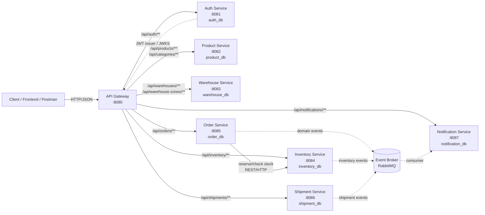

# WMS Microservices — Architecture & Coding Guide

Tài liệu này là bản hướng dẫn tổng thể cho 8 project của WMS được tách từ `schema.sql` đã cung cấp.

> **Phạm vi hiện tại:** `auth-service` đã có code API login/register/refresh/logout/me và JWT. 7 service còn lại hiện là **Spring Boot skeleton + security + Flyway + database migration**; controller/service/entity/repository nghiệp vụ sẽ được xây tiếp theo đúng kiến trúc trong README của từng project. Không nên hiểu các API demo nghiệp vụ bên dưới là đã được implement trong source hiện tại.

## 1. Sơ đồ tổng thể 8 project



### Ranh giới database

Mỗi service **sở hữu DB của chính nó**. Không tạo PostgreSQL FK giữa các DB/service.

| Project                  | Port | Database            | Tables từ schema                         |
| ------------------------ | ---: | ------------------- | ----------------------------------------- |
| `api-gateway`          | 8080 | Không có          | Không có                                |
| `auth-service`         | 8081 | `auth_db`         | `users`, `refresh_tokens`             |
| `product-service`      | 8082 | `product_db`      | `categories`, `products`              |
| `warehouse-service`    | 8083 | `warehouse_db`    | `warehouses`, `warehouse_zones`       |
| `inventory-service`    | 8084 | `inventory_db`    | `inventory`, `inventory_transactions` |
| `order-service`        | 8085 | `order_db`        | `orders`, `order_items`               |
| `shipment-service`     | 8086 | `shipment_db`     | `shipments`                             |
| `notification-service` | 8087 | `notification_db` | `notifications`                         |

Các bảng và quan hệ được phân service theo schema gốc: users/refresh token; categories/products; warehouses/zones; inventory/transactions; orders/items; shipments; notifications. Các ID như `product_id`, `user_id`, `warehouse_id` khi nằm ở service khác chỉ là **logical reference**.

## 2. Công nghệ và thư viện

- Java 17
- Spring Boot 3.x
- Spring Cloud Gateway (Spring Cloud 2023.x tương thích Spring Boot 3)
- Spring MVC / WebMVC
- Spring Security
- OAuth2 Resource Server + JOSE/JWT
- Spring Data JPA + Hibernate
- MyBatis (cho query phức tạp, search, báo cáo)
- PostgreSQL 15+
- Flyway + Flyway PostgreSQL
- Bean Validation
- Actuator
- JUnit 5 / Spring Boot Test / Testcontainers
- RabbitMQ (event broker)
- Redis (cache/coordination)
- Gradle Wrapper
- WAR package, External Tomcat 10.1 (Servlet 6.0)

## 3. Quy tắc kiến trúc khi code

Mỗi service đi theo pipeline:

```text
HTTP request
  -> Controller
  -> Request DTO + validation
  -> Application/Service use case
  -> Domain/business rule
  -> Repository
  -> JPA Entity / MyBatis Mapper
  -> PostgreSQL
  -> Response DTO
  -> HTTP response
```

Khi service cần gọi service khác:

```text
OrderController
  -> OrderApplicationService
  -> InventoryClient (HTTP)
  -> Inventory Service
  -> Inventory DB
```

Khi cần bất đồng bộ:

```text
Business transaction
  -> event/outbox
  -> RabbitMQ
  -> Notification consumer
  -> notification_db
```

### Quy tắc quan trọng

1. Controller không viết SQL.
2. Controller không chứa business rule.
3. Entity không được trả thẳng ra API; dùng DTO.
4. Transaction nghiệp vụ đặt ở application/service layer.
5. Repository chỉ phụ trách persistence.
6. Service không truy cập DB của service khác.
7. Cross-service communication đi qua HTTP client hoặc event broker.
8. Migration dùng Flyway, không dùng `ddl-auto=create`.
9. JWT được xác thực ở Gateway và **mỗi service vẫn phải validate JWT** ở boundary của chính nó.
10. Không commit private signing key.

## 4. Cách đọc source

Mỗi project có 3 nhóm chính:

```text
src/main/java
    application bootstrap
    config/security
    controller          <- inbound HTTP
    dto                 <- API contract
    service             <- use case/business orchestration
    repository         <- persistence contract
    entity              <- database model (JPA)
    mapper              <- MyBatis mapper interface (nếu có)
    client              <- outbound service call (khi cần)
    event              <- RabbitMQ/event model (khi cần)

src/main/resources
    application.yml
    db/migration/*.sql
    mybatis/mapper/*.xml  <- MyBatis XML mapper (nếu có)

src/main/webapp
    WEB-INF/web.xml       <- optional cho Tomcat deployment
```

`auth-service` hiện đang dùng package đơn giản (`controller`, `service`, `repository`, ...). Khi mở rộng các service nghiệp vụ, có thể giữ cách này hoặc chuyển sang package theo feature; README của từng service mô tả cấu trúc đề xuất.

## 5. Demo luồng request tổng quát

Ví dụ frontend gọi:

```http
GET /api/products/100
Authorization: Bearer eyJ...
```

Luồng thực tế:

```text
Client
  |
  | HTTP GET /api/products/100
  v
API Gateway :8080
  |
  | 1. kiểm tra Bearer JWT
  | 2. route theo Path
  v
Product Service :8082
  |
  | 3. SecurityFilterChain validate JWT
  | 4. Controller nhận request
  v
ProductApplicationService
  |
  | 5. business rule
  v
ProductRepository
  |
  | 6. SQL qua Hibernate/JPA
  v
product_db
  |
  | 7. entity -> response DTO
  v
Product Service
  |
  v
Gateway -> Client
```

Nếu có lỗi validation/business/database thì exception handler chuyển thành HTTP status + JSON error chuẩn.

## 6. Demo auth flow đã implement

### Register

```http
POST http://localhost:8080/api/auth/register
Content-Type: application/json

{
  "username": "admin",
  "email": "admin@example.com",
  "password": "ChangeMe123!"
}
```

### Login

```http
POST http://localhost:8080/api/auth/login
Content-Type: application/json

{
  "username": "admin",
  "password": "ChangeMe123!"
}
```

Response trả `accessToken` và `refreshToken`.

### Call API có JWT

```http
GET http://localhost:8080/api/auth/me
Authorization: Bearer <accessToken>
```

### Refresh

```http
POST http://localhost:8080/api/auth/refresh
Content-Type: application/json

{
  "refreshToken": "<refreshToken>"
}
```

Refresh token được rotate: token cũ bị revoke và token mới được lưu.

## 7. Chạy hệ thống

### Bước 1 — PostgreSQL, Redis, RabbitMQ

```bash
docker compose -f infrastructure/docker-compose.yml up -d postgres redis rabbitmq
```

### Bước 2 — Build WAR với Gradle Wrapper

Mỗi service là một dự án Gradle độc lập. Build artifact WAR:

```bash
cd services/auth-service
../gradlew clean test bootWar
```

Artifact: `build/libs/auth-service.war`

### Bước 3 — Deploy lên External Tomcat 10.1

Copy WAR vào `<TOMCAT_HOME>/webapps/`:

```bash
copy services\auth-service\build\libs\auth-service.war %TOMCAT_HOME%\webapps\
```

Khởi động Tomcat:

```bash
%TOMCAT_HOME%\bin\startup.bat
```

### Bước 4 — Chạy các service khác

Lặp lại Bước 2-3 cho từng service:
- `product-service` (port 8082)
- `warehouse-service` (port 8083)
- `inventory-service` (port 8084)
- `order-service` (port 8085)
- `shipment-service` (port 8086)
- `notification-service` (port 8087)
- `api-gateway` (port 8080)

### Health check

```text
GET http://localhost:8080/actuator/health
```

> **Lưu ý:** Trong môi trường dev có thể chạy `../gradlew bootRun` để test nhanh, nhưng artifact triển khai chính thức là WAR trên Tomcat 10.1.

## 8. Thứ tự code một feature mới

Ví dụ thêm `POST /api/products`:

```text
1. Xác định use case + permission
2. Tạo Request DTO
3. Tạo Response DTO
4. Tạo/hoàn thiện Entity
5. Tạo Repository
6. Viết Application Service
7. Viết Controller
8. Viết migration nếu DB thay đổi
9. Viết unit test
10. Viết integration test
11. Route qua Gateway
12. Demo bằng curl/Postman
```

Không bắt đầu bằng Controller rồi nhồi toàn bộ nghiệp vụ vào Controller.

### Cấu trúc file cho feature Product

```text
product-service/src/main/java/com/wms/product/
├── controller/ProductController.java
├── dto/CreateProductRequest.java
├── dto/ProductResponse.java
├── service/ProductApplicationService.java
├── repository/ProductRepository.java
├── entity/ProductEntity.java
├── exception/ApiException.java
└── config/SecurityConfig.java
```

Request DTO chứa rule đầu vào; Controller chỉ nhận HTTP; ApplicationService kiểm tra category/SKU và transaction; Repository/Entity lo persistence; Response DTO không trả JPA Entity.

```java
public record CreateProductRequest(
  @NotBlank @Size(max = 100) String sku,
  @NotBlank @Size(max = 255) String name,
  @NotNull @DecimalMin("0.00") BigDecimal price,
  Long categoryId,
  @NotBlank String status
) {}
```

```java
@PostMapping
public ResponseEntity<ProductResponse> create(
  @Valid @RequestBody CreateProductRequest request) {
    ProductResponse response = productService.create(request);
    return ResponseEntity.status(HttpStatus.CREATED).body(response);
}
```

Trong `ProductApplicationService.create`, chuẩn hóa SKU -> kiểm tra trùng -> kiểm tra category nếu có -> map request sang entity -> `repository.save` trong `@Transactional` -> map sang response. Dùng `@ControllerAdvice` để map duplicate thành 409 và validation thành 400. Chi tiết đầy đủ theo domain xem README của từng service.

## 9. README của từng project

- [`api-gateway/README.md`](api-gateway/README.md) — routing, JWT boundary, flow Gateway.
- [`auth-service/README.md`](auth-service/README.md) — login/JWT/refresh rotation và code thật đang có.
- [`product-service/README.md`](product-service/README.md) — catalog/product/category.
- [`warehouse-service/README.md`](warehouse-service/README.md) — warehouse/zone.
- [`inventory-service/README.md`](inventory-service/README.md) — stock/transaction và concurrency.
- [`order-service/README.md`](order-service/README.md) — order/order item và gọi inventory.
- [`shipment-service/README.md`](shipment-service/README.md) — shipment/tracking.
- [`notification-service/README.md`](notification-service/README.md) — notification + RabbitMQ consumer.

## 10. Trạng thái source hiện tại

| Project      | Bootstrap | Security | Migration | Business API             | Build Tool |
| ------------ | --------- | -------- | --------- | ------------------------ | ---------- |
| Gateway      | Có       | Có      | N/A       | Route config             | Gradle     |
| Auth         | Có       | Có      | Có       | **Đã implement**         | Gradle     |
| Product      | Có       | Có      | Có       | Chưa implement           | Gradle     |
| Warehouse    | Có       | Có      | Có       | Chưa implement           | Gradle     |
| Inventory    | Có       | Có      | Có       | Chưa implement           | Gradle     |
| Order        | Có       | Có      | Có       | Chưa implement           | Gradle     |
| Shipment     | Có       | Có      | Có       | Chưa implement           | Gradle     |
| Notification | Có       | Có      | Có       | Chưa implement           | Gradle     |

## 11. Lưu ý môi trường

Workspace hiện là scaffold tài liệu: thư mục service chưa có controller/entity. Các API, quy trình build và deployment trong tài liệu là hợp đồng mục tiêu để triển khai.

Baseline: JDK 17, Gradle Wrapper, PostgreSQL, Redis, RabbitMQ, Docker và Tomcat 10.1 tương thích.

```bash
docker compose -f infrastructure/docker-compose.yml up -d postgres redis rabbitmq
./gradlew clean test bootWar
```

Artifact mục tiêu: `build/libs/<service>.war`; triển khai vào `<TOMCAT_HOME>/webapps/`.
