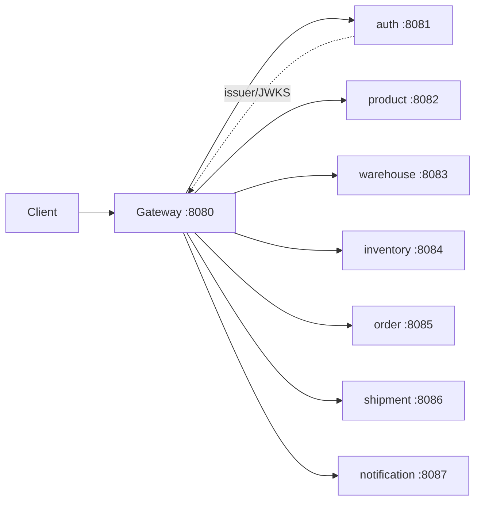

# api-gateway

## 1. Vai trò

API Gateway là entry point của client. Gateway không sở hữu business database. Nó định tuyến request đến đúng microservice và xác thực Bearer JWT ở edge.



## 2. Thư viện

- `spring-cloud-starter-gateway-server-webmvc`: routing
- `spring-boot-starter-security`: security filter chain
- `spring-boot-starter-oauth2-resource-server`: JWT resource server
- `spring-security-oauth2-jose`: JWT/JWK/JOSE
- `spring-boot-starter-actuator`: health/gateway endpoint

## 3. Cấu trúc source

```text
api-gateway/
├── build.gradle
├── README.md
└── src/main
    ├── java/com/wms/gateway
    │   ├── GatewayApplication.java
    │   └── SecurityConfig.java
    └── resources
        └── application.yml
```

Khi mở rộng (Port/Adapter pattern cho Gateway):

```text
com.wms.gateway
├── config/          # route, security, CORS
├── filter/          # correlation-id, logging, rate limit
├── handler/         # fallback, error handling
└── GatewayApplication.java
```

## 4. Route hiện tại

| Path | Target |
|---|---|
| `/api/auth/**`, `/.well-known/jwks.json` | `http://localhost:8081` |
| `/api/products/**`, `/api/categories/**` | `http://localhost:8082` |
| `/api/warehouses/**`, `/api/warehouse-zones/**` | `http://localhost:8083` |
| `/api/inventory/**` | `http://localhost:8084` |
| `/api/orders/**` | `http://localhost:8085` |
| `/api/shipments/**` | `http://localhost:8086` |
| `/api/notifications/**` | `http://localhost:8087` |

## 5. Cách code

Gateway chỉ nên làm cross-cutting concerns:

- authentication/JWT boundary
- routing
- CORS
- correlation ID
- logging/metrics
- rate limiting khi cần

Không đặt `ProductService`, `OrderService` business rule vào Gateway.

## 6. Demo flow

```http
GET http://localhost:8080/api/products/1
Authorization: Bearer <JWT>
```

```text
Client
  -> Gateway :8080
  -> JWT validation
  -> route /api/products/**
  -> Product Service :8082
  -> response
  -> Gateway
  -> Client
```

Health:

```http
GET http://localhost:8080/actuator/health
```

## 7. Cấu hình

`application.yml` dùng các biến môi trường:

```text
JWT_ISSUER
AUTH_SERVICE_URL
PRODUCT_SERVICE_URL
WAREHOUSE_SERVICE_URL
INVENTORY_SERVICE_URL
ORDER_SERVICE_URL
SHIPMENT_SERVICE_URL
NOTIFICATION_SERVICE_URL
SERVER_PORT
```

Ví dụ chạy Gateway khi service ở Docker network:

```bash
export AUTH_SERVICE_URL=http://auth-service:8081
export PRODUCT_SERVICE_URL=http://product-service:8082
./gradlew bootRun
```

## 8. Cách cấu hình route và security

Route được khai báo trong `src/main/resources/application.yml`; mỗi service cần một route rõ ràng theo API prefix:

```yaml
spring:
    cloud:
        gateway:
            server:
                webmvc:
                    routes:
                        - id: product-service
                            uri: ${PRODUCT_SERVICE_URL:http://localhost:8082}
                            predicates:
                                - Path=/api/products/**,/api/categories/**
```

Security filter chain chỉ cho phép endpoint public; các route khác cần Bearer JWT:

```java
@Bean
SecurityFilterChain securityFilterChain(HttpSecurity http) throws Exception {
        return http
                        .csrf(AbstractHttpConfigurer::disable)
                        .sessionManagement(session -> session
                                        .sessionCreationPolicy(SessionCreationPolicy.STATELESS))
                        .authorizeHttpRequests(auth -> auth
                                        .requestMatchers(
                                                        "/api/auth/register",
                                                        "/api/auth/login",
                                                        "/api/auth/refresh",
                                                        "/.well-known/jwks.json",
                                                        "/actuator/health"
                                                ).permitAll()
                                                .anyRequest().authenticated())
                        .oauth2ResourceServer(oauth -> oauth.jwt(jwt -> {}))
                        .build();
}
```

Sau khi thêm route: kiểm tra path không overlap, gọi trực tiếp service để cô lập lỗi, rồi gọi lại qua Gateway. Gateway xác thực JWT ở biên; service đích vẫn phải tự validate token và quyền.

**Test tối thiểu:** route đúng service, route không tồn tại trả 404, thiếu JWT trả 401, JWT hợp lệ qua Gateway tới được service, downstream lỗi giữ được correlation/trace ID.
