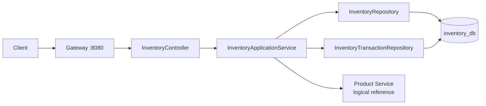

# inventory-service

## 1. Vai trò

Inventory Service quản lý số lượng tồn và lịch sử biến động:

- `inventory`
- `inventory_transactions`

Đây là service cần chú ý nhất về concurrency vì nhiều request có thể cùng điều chỉnh một SKU trong một kho.



## 2. Thư viện

WebMVC, Validation, Security, OAuth2 Resource Server/JOSE, JPA, PostgreSQL, Flyway, Actuator, Test.

## 3. Source hiện tại

```text
inventory-service/
├── pom.xml
└── src/main
    ├── java/com/wms/inventory
    │   ├── InventoryApplication.java
    │   └── SecurityConfig.java
    └── resources
        ├── application.yml
        └── db/migration/V1__schema.sql
```

Cấu trúc mục tiêu:

```text
com.wms.inventory
├── controller/
├── dto/
├── service/
│   ├── InventoryApplicationService.java
│   └── StockReservationService.java
├── repository/
├── entity/
├── client/
│   └── ProductClient.java
├── exception/
└── config/
```

## 4. API mục tiêu

```text
GET  /api/inventory
GET  /api/inventory/{id}
POST /api/inventory/adjust
POST /api/inventory/reserve
POST /api/inventory/release
GET  /api/inventory/transactions
```

Đây là API mục tiêu; controller nghiệp vụ chưa có trong source hiện tại.

## 5. Quy tắc concurrency

Khi update stock, không làm:

```text
SELECT quantity
UPDATE quantity = quantity - x
```

mà không có locking/version.

Thiết kế mục tiêu nên dùng optimistic locking (`@Version`) hoặc atomic update/pessimistic lock tùy use case. Mọi thay đổi tồn phải ghi `inventory_transactions` trong cùng transaction.

## 6. Demo reserve stock

```http
POST http://localhost:8080/api/inventory/reserve
Authorization: Bearer <JWT>
Content-Type: application/json

{
  "productId": "...",
  "warehouseId": "...",
  "quantity": 5,
  "orderId": "..."
}
```

Luồng:

```text
Client
 -> Gateway/JWT
 -> InventoryController
 -> InventoryApplicationService.reserve()
 -> lock/version check
 -> update inventory
 -> insert inventory_transaction
 -> commit
 -> response
```

Nếu Order Service gọi reserve:

```text
Order Service
 -> HTTP Inventory API
 -> Inventory transaction
 -> success/failure
 -> Order Service tiếp tục hoặc rollback state theo business flow
```

## 7. Cross-service rule

`product_id` và `warehouse_id` là ID tham chiếu logic. Không tạo FK PostgreSQL sang `product_db` hoặc `warehouse_db`.

## 8. Cách code điều chỉnh tồn cụ thể

Migration dùng khóa chính ghép `(product_id, warehouse_id)` và cột `version`. Repository/entity phải ánh xạ đúng khóa ghép; không khai báo một `Long id` giả.

### Request DTO

```java
public record AdjustInventoryRequest(
    @NotNull Long productId,
    @NotNull Long warehouseId,
    @NotNull Integer quantityDelta,
    @NotBlank String reason,
    String referenceNo
) {}
```

### Khóa ghép và entity

```java
@Embeddable
public class InventoryId implements Serializable {
  @Column(name = "product_id")
  private Long productId;

  @Column(name = "warehouse_id")
  private Long warehouseId;

  protected InventoryId() {}

  public InventoryId(Long productId, Long warehouseId) {
    this.productId = productId;
    this.warehouseId = warehouseId;
  }

  // Cần triển khai equals() và hashCode() dựa trên cả hai trường.
}

@Entity
@Table(name = "inventory")
public class InventoryEntity {
  @EmbeddedId
  private InventoryId id;

  @Column(nullable = false)
  private Integer quantity;

  @Column(name = "reserved_quantity", nullable = false)
  private Integer reservedQuantity;

  @Version
  @Column(nullable = false)
  private Long version;

  @UpdateTimestamp
  @Column(name = "updated_at", nullable = false)
  private Instant updatedAt;
}
```

### Repository, use case và controller

```java
public interface InventoryRepository
    extends JpaRepository<InventoryEntity, InventoryId> {}

public interface InventoryTransactionRepository
    extends JpaRepository<InventoryTransactionEntity, Long> {}
```

```java
@Transactional
public InventoryResponse adjust(AdjustInventoryRequest request) {
  authorizeWarehouse(request.warehouseId());
  InventoryId id = new InventoryId(request.productId(), request.warehouseId());
  InventoryEntity stock = inventory.findById(id)
      .orElseThrow(() -> new ApiException(HttpStatus.NOT_FOUND, "Inventory not found"));

  int nextQuantity = stock.getQuantity() + request.quantityDelta();
  if (nextQuantity < stock.getReservedQuantity() || nextQuantity < 0) {
    throw new ApiException(HttpStatus.UNPROCESSABLE_ENTITY, "Insufficient available stock");
  }

  stock.setQuantity(nextQuantity); // @Version phát hiện cập nhật đồng thời khi flush.
  transactions.save(InventoryTransactionEntity.adjustment(
      request.productId(), request.warehouseId(),
      request.quantityDelta(), request.referenceNo()));
  return InventoryResponse.from(stock);
}
```

Controller dùng `POST /api/inventory/adjust`, nhận `@Valid @RequestBody AdjustInventoryRequest`, gọi service và trả response DTO. Cả update tồn và insert `inventory_transactions` phải nằm trong cùng `@Transactional`. Ánh xạ `OptimisticLockingFailureException` thành 409; lỗi số lượng thành 422.

**Chọn một cách ghi:** ví dụ trên dùng JPA `@Version`; không gọi thêm `sp_adjust_inventory` trong cùng request. Nếu chọn procedure, trước tiên phải đưa function/procedure vào Flyway migration của `inventory_db`, sau đó dùng adapter gọi procedure thay cho cập nhật JPA, không chạy cả hai cách.

Sau commit mới xóa cache và phát event qua outbox. Không gọi Product/Warehouse DB trực tiếp; nếu cần xác minh ID hoặc hiển thị tên, dùng API client hoặc dữ liệu projection/cache có quy tắc rõ ràng.

### Test cần có

- Điều chỉnh hợp lệ tạo đúng một inventory transaction.
- Số lượng mới thấp hơn `reserved_quantity` trả 422 và rollback.
- Hai request cùng `version` không thể cùng ghi đè; request xung đột trả 409.
- User không được gán warehouse trả 403.
- Procedure/JPA không bị thực thi kép trong cùng request.
