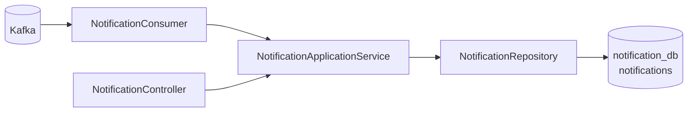

# notification-service

## 1. Vai trò

Notification Service sở hữu bảng `notifications` và là nơi nhận các domain event để tạo notification cho người dùng.



## 2. Thư viện

- WebMVC
- Validation
- Spring Security
- OAuth2 Resource Server + JOSE
- Spring Data JPA
- PostgreSQL
- Flyway
- Actuator
- `spring-boot-starter-kafka`
- Spring Boot Test

## 3. Source hiện tại

```text
notification-service/
├── pom.xml
└── src/main
    ├── java/com/wms/notification
    │   ├── NotificationApplication.java
    │   └── SecurityConfig.java
    └── resources
        ├── application.yml
        └── db/migration/V1__schema.sql
```

Kafka dependency đã có trong POM, nhưng consumer/controller nghiệp vụ chưa được implement trong source hiện tại.

Cấu trúc mục tiêu:

```text
com.wms.notification
├── controller/
├── dto/
├── service/
├── repository/
├── entity/
├── consumer/
│   └── NotificationEventConsumer.java
├── event/
├── exception/
└── config/
```

## 4. API mục tiêu

```text
GET  /api/notifications
GET  /api/notifications/{id}
POST /api/notifications/{id}/read
POST /api/notifications/read-all
```

## 5. Event flow

Các event có thể đến từ Order/Inventory/Shipment:

```text
Order/Inventory/Shipment
        |
        | domain event
        v
      Kafka
        |
        v
NotificationEventConsumer
        |
        v
NotificationApplicationService
        |
        v
notification_db
```

Consumer nên đảm bảo idempotency: cùng một event được giao lại không tạo duplicate notification.

## 6. Demo flow mục tiêu

Ví dụ Shipment Service phát event:

```json
{
  "eventId": "...",
  "eventType": "shipment.status.changed",
  "aggregateId": "...",
  "userId": "...",
  "status": "DELIVERED"
}
```

Consumer xử lý:

```text
Kafka message
 -> deserialize event
 -> kiểm tra eventId đã xử lý chưa
 -> tạo notification
 -> commit DB
 -> ACK/commit Kafka offset
```

Nếu ghi DB thất bại, không ACK để message có thể retry theo policy. Production nên có retry/DLQ.

## 7. Cách code consumer idempotent

Migration có unique constraint `(event_id, user_id)`. Ứng dụng phải luôn cung cấp `user_id`; nếu để NULL, unique constraint PostgreSQL vẫn cho phép nhiều dòng NULL.

### Event DTO

```java
public record ShipmentStatusChangedEvent(
                String eventId,
                UUID userId,
                UUID shipmentId,
                String trackingNumber,
                String status,
                Instant occurredAt,
                String correlationId
) {}
```

### Consumer và application service

```java
@KafkaListener(topics = "${app.kafka.topics.shipment-events}")
public void consume(ShipmentStatusChangedEvent event, Acknowledgment acknowledgment) {
        notificationService.createIfAbsent(event); // transaction commit xong mới return
        acknowledgment.acknowledge();
}
```

```java
@Transactional
public void createIfAbsent(ShipmentStatusChangedEvent event) {
        if (notifications.existsByEventIdAndUserId(event.eventId(), event.userId())) {
                return;
        }
        notifications.insertIfAbsent(
                        event.userId(), event.eventId(), "SHIPMENT_STATUS_CHANGED",
                        "Trạng thái vận chuyển đã thay đổi",
                        "Đơn " + event.trackingNumber() + " hiện ở trạng thái " + event.status());
}
```

`exists...` giúp bỏ qua bản trùng thông thường nhưng không chặn race giữa hai consumer. Repository nên dùng atomic insert `ON CONFLICT DO NOTHING` dựa trên unique constraint:

```sql
INSERT INTO notifications (user_id, event_id, type, title, message, status)
VALUES (:user_id, :event_id, :type, :title, :message, 'UNREAD')
ON CONFLICT (event_id, user_id) DO NOTHING;
```

Chỉ ACK sau khi transaction insert kết thúc thành công. Cấu hình listener manual acknowledgment, retry có giới hạn và DLQ; message lỗi vĩnh viễn cần log event ID/correlation ID rồi chuyển DLQ, không lặp retry vô hạn.

### API đọc và đánh dấu đã đọc

`NotificationController` lấy `userId` từ JWT/SecurityContext, không nhận `userId` tùy ý từ query/body. Repository luôn lọc cả `id` và `user_id`:

```sql
UPDATE notifications
SET status = 'READ'
WHERE id = :notification_id
  AND user_id = :authenticated_user_id
  AND status <> 'READ';
```

Không tìm thấy hoặc không thuộc user hiện tại -> trả 404/403 theo policy disclosure. Mark-read lặp lại nhiều lần vẫn idempotent.
