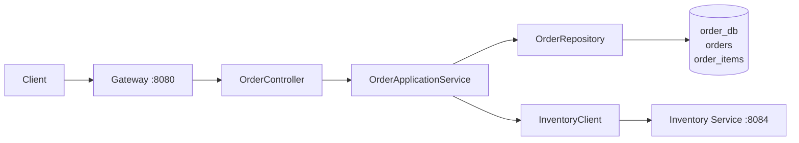

# order-service

## 1. Vai trò

Quản lý `orders` và `order_items`. Order Service là nơi điều phối trạng thái đơn và cần giao tiếp với Inventory Service để kiểm tra/giữ tồn.



## 2. Thư viện

WebMVC, Validation, Security, OAuth2 Resource Server/JOSE, JPA, PostgreSQL, Flyway, Actuator, Test.

## 3. Source hiện tại

```text
order-service/
├── pom.xml
└── src/main
    ├── java/com/wms/order
    │   ├── OrderApplication.java
    │   └── SecurityConfig.java
    └── resources
        ├── application.yml
        └── db/migration/V1__schema.sql
```

Cấu trúc mục tiêu:

```text
com.wms.order
├── controller/
├── dto/
├── service/
│   ├── OrderApplicationService.java
│   └── OrderStateService.java
├── repository/
├── entity/
├── client/
│   └── InventoryClient.java
├── exception/
└── config/
```

## 4. API mục tiêu

```text
POST /api/orders
GET  /api/orders/{id}
GET  /api/orders
POST /api/orders/{id}/confirm
POST /api/orders/{id}/cancel
```

Chưa implement trong source hiện tại.

## 5. Tư duy state transition

Không cho phép Controller tự ý đổi `status`.

```text
OrderApplicationService
 -> kiểm tra current state
 -> kiểm tra transition hợp lệ
 -> gọi Inventory Service nếu cần
 -> cập nhật order/order_items
 -> phát event nếu cần
```

## 6. Demo tạo đơn

```http
POST http://localhost:8080/api/orders
Authorization: Bearer <JWT>
Content-Type: application/json

{
  "userId": "...",
  "items": [
    {"productId":"...", "quantity":2}
  ]
}
```

Luồng mục tiêu:

```text
Client
 -> Gateway
 -> OrderController
 -> OrderApplicationService
 -> transaction ngắn: lưu order trạng thái PENDING
 -> commit order_db
 -> InventoryClient.reserve() với idempotency key
 -> Inventory Service
 -> transaction ngắn: reserve thành công thì cập nhật CONFIRMED
 -> response
```

Không giữ transaction DB mở khi gọi Inventory Service. Nếu reserve thất bại, chuyển order về trạng thái phù hợp; nếu timeout không rõ kết quả, retry/query bằng cùng idempotency key. Order Service không tự truy cập inventory_db để sửa dữ liệu.

## 7. Cách code create/confirm order

`order-service` sở hữu `orders` và `order_items`; không thêm JPA relationship sang Product/Inventory DB. Các ID của product/user/kho là logical reference. Migration hiện chưa có `warehouse_id` trong `orders`; cần migration trước khi lọc/phân quyền order theo kho.

### Request DTO và repository

```java
public record CreateOrderRequest(
  @NotBlank String type,
  @NotEmpty List<@Valid OrderItemRequest> items
) {}

public record OrderItemRequest(
  @NotNull Long productId,
  @Positive Integer quantity
) {}
```

```java
public interface OrderRepository extends JpaRepository<OrderEntity, UUID> {
    Optional<OrderEntity> findByOrderNo(String orderNo);
}

public interface OrderItemRepository extends JpaRepository<OrderItemEntity, Long> {
    List<OrderItemEntity> findByOrderId(UUID orderId);
}
```

### Tạo đơn trong một local transaction

Gọi Product Service lấy giá trước khi mở transaction ghi order. Tách orchestration và persistence thành hai bean để Spring proxy áp dụng `@Transactional` cho đúng:

```java
public OrderResponse create(CreateOrderRequest request, UUID userId) {
    validateOrderType(request.type());
    List<PricedOrderItem> pricedItems = productClient.getCurrentPrices(request.items());
  return orderWriter.savePending(request, userId, pricedItems);
}
```

```java
@Service
public class OrderWriter {
  @Transactional
  public OrderResponse savePending(CreateOrderRequest request,
                   UUID userId,
                   List<PricedOrderItem> pricedItems) {
    BigDecimal total = pricedItems.stream()
      .map(item -> item.unitPrice().multiply(BigDecimal.valueOf(item.quantity())))
      .reduce(BigDecimal.ZERO, BigDecimal::add);

    OrderEntity order = orders.save(OrderEntity.pending(
      UUID.randomUUID(), generateOrderNo(), userId, request.type(), total));
    items.saveAll(pricedItems.stream()
      .map(item -> OrderItemEntity.from(order, item))
      .toList());
    return OrderResponse.from(order, pricedItems);
      }
}
```

    Giá phải lấy từ Product Service, không tin giá/tổng tiền do client gửi. Network call chạy ngoài transaction Order DB; header và tất cả order item vẫn được ghi cùng một transaction. Cần quyết định rõ khi Product Service không truy cập được thì tạo đơn fail hay dùng snapshot giá đã được xác nhận.

### Confirm qua Inventory Service

Không giữ transaction PostgreSQL mở trong lúc gọi HTTP sang Inventory. Dùng orchestration/saga:

```text
1. Transaction ngắn: PENDING -> CONFIRMING, lưu idempotency/request key
2. Gọi InventoryClient.reserve(orderId, lines, idempotencyKey)
3. Inventory trả thành công: transaction ngắn -> CONFIRMED + lưu outbox event
4. Inventory lỗi: transaction ngắn -> PENDING/FAILED theo policy
5. Nếu timeout không rõ kết quả: truy vấn/retry bằng cùng idempotency key
```

`OrderApplicationService` điều phối state; `InventoryClient` chỉ gọi `/api/inventory/...`; không được inject `InventoryRepository` hoặc mở connection tới inventory_db.

### Test cần có

- Tạo order lưu header và các line trong cùng local transaction.
- Giá/tổng tiền lấy từ catalog response và tính bằng `BigDecimal`.
- Confirm đúng state gọi reserve đúng một lần theo idempotency key.
- Inventory timeout không làm order chuyển `CONFIRMED` sai.
- Cancel/confirm sai state trả 409; lỗi validation trả 400.
