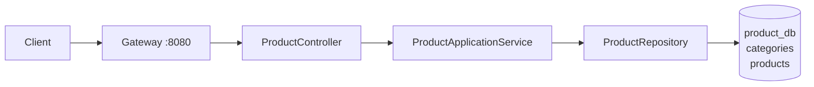

# product-service

## 1. Vai trò

Quản lý catalog: `categories` và `products`.



## 2. Thư viện

WebMVC, Validation, Security, OAuth2 Resource Server/JOSE, JPA, PostgreSQL, Flyway, Actuator, Test.

## 3. Source hiện tại

```text
product-service/
├── pom.xml
└── src/main
    ├── java/com/wms/product
    │   ├── ProductApplication.java
    │   └── SecurityConfig.java
    └── resources
        ├── application.yml
        └── db/migration/V1__schema.sql
```

Đây là skeleton. Khi code nghiệp vụ, dùng:

```text
com.wms.product
├── controller/
├── dto/
├── service/
├── repository/
├── entity/
├── exception/
└── config/
```

## 4. Database

`categories` chứa nhóm sản phẩm; `products` chứa SKU/tên/giá và `category_id` thuộc logical boundary của product service.

## 5. API đề xuất

```text
GET    /api/categories
GET    /api/categories/{id}
POST   /api/categories
PUT    /api/categories/{id}
DELETE /api/categories/{id}

GET    /api/products
GET    /api/products/{id}
POST   /api/products
PUT    /api/products/{id}
DELETE /api/products/{id}
```

Các endpoint trên là **thiết kế mục tiêu**, chưa có controller trong source hiện tại.

## 6. Cách code một API

Ví dụ `POST /api/products`:

```text
ProductController.create()
 -> CreateProductRequest validation
 -> ProductApplicationService.create()
 -> kiểm tra category
 -> ProductRepository.save()
 -> Product entity
 -> ProductResponse
```

Controller mẫu về mặt kiến trúc:

```java
@PostMapping
public ResponseEntity<ProductResponse> create(
        @Valid @RequestBody CreateProductRequest request) {
    return ResponseEntity.status(HttpStatus.CREATED)
            .body(productService.create(request));
}
```

Business rule nằm trong service, không nằm trong đoạn controller.

## 7. Demo flow

```http
POST http://localhost:8080/api/products
Authorization: Bearer <JWT>
Content-Type: application/json

{
  "sku": "SKU-001",
  "name": "Keyboard",
  "categoryId": "..."
}
```

Luồng:

```text
Client
 -> Gateway JWT validation
 -> ProductController
 -> ProductApplicationService
 -> ProductRepository
 -> product_db
 -> ProductResponse
 -> Gateway
 -> Client
```

## 8. Cross-service rule

Inventory Service có thể lưu `product_id`, nhưng không JOIN trực tiếp `product_db`. Nếu cần tên sản phẩm, gọi Product API hoặc dùng event/cache phù hợp.

## 9. Cách code CRUD Product cụ thể

Migration hiện có `products.id BIGSERIAL`, `sku` unique, `price NUMERIC(18,2)`, `category_id BIGINT` và `status`. `category_id` chưa có FK trong migration, vì vậy kiểm tra category ở service và bổ sung FK bằng migration riêng nếu muốn DB enforce quan hệ.

### 9.1 Request DTO

```java
public record CreateProductRequest(
    @NotBlank @Size(max = 100) String sku,
    @NotBlank @Size(max = 255) String name,
    String description,
    @NotNull @DecimalMin("0.00") BigDecimal price,
    Long categoryId,
    @NotBlank String status
) {}
```

### 9.2 Entity và repository

```java
@Entity
@Table(name = "products")
public class ProductEntity {
  @Id
  @GeneratedValue(strategy = GenerationType.IDENTITY)
  private Long id;

  @Column(nullable = false, unique = true, length = 100)
  private String sku;

  @Column(nullable = false, length = 255)
  private String name;

  private String description;

  @Column(nullable = false, precision = 18, scale = 2)
  private BigDecimal price;

  @Column(name = "category_id")
  private Long categoryId;

  @Column(nullable = false, length = 20)
  private String status;
}
```

```java
public interface ProductRepository extends JpaRepository<ProductEntity, Long> {
  boolean existsBySku(String sku);
  Page<ProductEntity> findByNameContainingIgnoreCase(String keyword, Pageable pageable);
}

public interface CategoryRepository extends JpaRepository<CategoryEntity, Long> {}
```

### 9.3 Service và controller

```java
@Service
public class ProductApplicationService {
  private final ProductRepository products;
  private final CategoryRepository categories;

  public ProductApplicationService(ProductRepository products, CategoryRepository categories) {
    this.products = products;
    this.categories = categories;
  }

  @Transactional
  public ProductEntity create(CreateProductRequest request) {
    String sku = request.sku().trim();
    if (products.existsBySku(sku)) {
      throw new ApiException(HttpStatus.CONFLICT, "SKU already exists");
    }
    if (request.categoryId() != null && !categories.existsById(request.categoryId())) {
      throw new ApiException(HttpStatus.BAD_REQUEST, "Category not found");
    }
    if (!Set.of("ACTIVE", "INACTIVE").contains(request.status())) {
      throw new ApiException(HttpStatus.BAD_REQUEST, "Invalid product status");
    }

    ProductEntity product = new ProductEntity();
    product.setSku(sku);
    product.setName(request.name().trim());
    product.setDescription(request.description());
    product.setPrice(request.price());
    product.setCategoryId(request.categoryId());
    product.setStatus(request.status());
    return products.save(product);
  }
}
```

Các snippet rút gọn bỏ phần getter/setter, constructor, mapper `ProductResponse.from` và import. Trong source thật cần tạo các phần này hoặc dùng record/MapStruct theo convention của project. `category_id` được phép NULL trong migration; chỉ kiểm tra tồn tại khi client gửi category ID.

```java
@RestController
@RequestMapping("/api/products")
public class ProductController {
  private final ProductApplicationService service;

  public ProductController(ProductApplicationService service) {
    this.service = service;
  }

  @PostMapping
  public ResponseEntity<ProductResponse> create(
      @Valid @RequestBody CreateProductRequest request) {
    ProductEntity saved = service.create(request);
    return ResponseEntity.status(HttpStatus.CREATED).body(ProductResponse.from(saved));
  }
}
```

Controller chỉ bind/validate DTO và gọi service; service kiểm tra SKU/quyền/transaction; repository làm persistence. Response phải là `ProductResponse`, không trả entity trực tiếp.

Các snippet trên tập trung vào luồng chính; source thực tế cần bổ sung import, accessor/constructor cho entity, `ProductResponse.from`, exception handler và test. Vì category ở cùng `product_db`, `CategoryRepository` có thể kiểm tra category; nếu bỏ category thì migration hiện vẫn cho phép `category_id = NULL`.

### 9.4 Swagger và test

- Thêm `@Operation`/`@ApiResponse` cho 201, 400, 401, 403 và 409.
- Unit test service: tạo hợp lệ, SKU trùng, category không hợp lệ.
- MockMvc test: JSON validation, status code, response DTO và yêu cầu JWT.
- Migration hiện không có FK `category_id`; nếu thêm quan hệ DB, migration và JPA mapping phải được cập nhật đồng thời.

CSV import/export được đặc tả tại mục S06 trong `README_SCREEN_SPEC.md`; controller/API chưa có trong source hiện tại.
