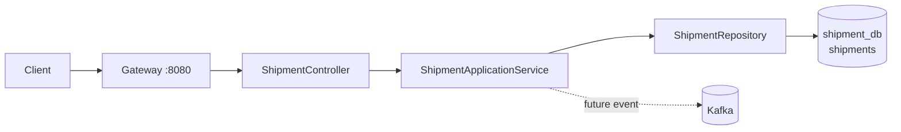

# shipment-service

## 1. Vai trò

Quản lý vận chuyển và tracking dựa trên bảng `shipments`.



## 2. Thư viện

WebMVC, Validation, Security, OAuth2 Resource Server/JOSE, JPA, PostgreSQL, Flyway, Actuator, Test.

## 3. Source hiện tại

```text
shipment-service/
├── pom.xml
└── src/main
    ├── java/com/wms/shipment
    │   ├── ShipmentApplication.java
    │   └── SecurityConfig.java
    └── resources
        ├── application.yml
        └── db/migration/V1__schema.sql
```

Cấu trúc mục tiêu:

```text
com.wms.shipment
├── controller/
├── dto/
├── service/
├── repository/
├── entity/
├── exception/
└── config/
```

## 4. API mục tiêu

```text
POST /api/shipments
GET  /api/shipments/{id}
GET  /api/shipments/{id}/tracking
PUT  /api/shipments/{id}/status
```

Chưa implement controller nghiệp vụ.

## 5. Demo tracking flow

```http
GET http://localhost:8080/api/shipments/{id}/tracking
Authorization: Bearer <JWT>
```

Luồng:

```text
Client -> Gateway -> ShipmentController
       -> ShipmentApplicationService
       -> ShipmentRepository
       -> shipment_db
       -> ShipmentResponse
       -> Client
```

Khi thay đổi trạng thái shipment, có thể phát event để Notification Service xử lý bất đồng bộ.

## 6. Cách code cập nhật trạng thái shipment

Schema có `order_id` unique, `tracking_number` unique và `status`; hiện chưa có cột `version` hoặc FK sang Order DB. Trước khi tạo shipment, kiểm tra đơn xuất qua Order API, không truy vấn `order_db` trực tiếp.

### DTO và trạng thái hợp lệ

```java
public record CreateShipmentRequest(
        @NotNull UUID orderId,
        @Size(max = 100) String carrier,
        @Size(max = 150) String trackingNumber
) {}

public enum ShipmentStatus {
    CREATED, IN_TRANSIT, DELIVERED, FAILED
}
```

Chốt transition table, ví dụ `CREATED -> IN_TRANSIT -> DELIVERED`; `FAILED` chỉ được đặt ở trạng thái phù hợp. Không nhận status tùy ý từ client.

### Repository và service

```java
public interface ShipmentRepository extends JpaRepository<ShipmentEntity, UUID> {
    boolean existsByOrderId(UUID orderId);
    boolean existsByTrackingNumber(String trackingNumber);
}
```

```java
public ShipmentResponse create(CreateShipmentRequest request) {
    orderClient.requireOutboundOrderReady(request.orderId());
    return shipmentWriter.create(request);
}
```

```java
@Service
public class ShipmentWriter {
    @Transactional
    public ShipmentResponse create(CreateShipmentRequest request) {
    if (shipments.existsByOrderId(request.orderId())) {
        throw new ApiException(HttpStatus.CONFLICT, "Shipment already exists for order");
    }
    ShipmentEntity shipment = ShipmentEntity.created(
            request.orderId(), request.carrier(), request.trackingNumber());
    return ShipmentResponse.from(shipments.save(shipment));
    }
}

@Transactional
public void changeStatus(UUID shipmentId, ShipmentStatus next) {
    ShipmentEntity shipment = shipments.findById(shipmentId)
            .orElseThrow(() -> new ApiException(HttpStatus.NOT_FOUND, "Shipment not found"));
    assertTransitionAllowed(shipment.getStatus(), next);
    int changed = shipments.changeStatusIfCurrent(
            shipmentId, shipment.getStatus(), next.name());
    if (changed == 0) {
        throw new ApiException(HttpStatus.CONFLICT, "Shipment status changed concurrently");
    }
    // Persist event/outbox in this service transaction; publisher dispatches after commit.
}
```

`changeStatusIfCurrent` nên là UPDATE có điều kiện `WHERE id=:id AND status=:expected`; cập nhật `updated_at` trong SQL hoặc dùng `@UpdateTimestamp`. Remote call tới Order Service chạy trước khi mở transaction Shipment DB. Unique violation của order/tracking number -> 409; unique constraint là lớp chống race cuối cùng.

```sql
UPDATE shipments
SET status = :next_status, updated_at = NOW()
WHERE id = :shipment_id AND status = :expected_status;
```

### Test

- Tạo shipment cho order chưa sẵn sàng -> từ chối.
- Tạo hai shipment cho cùng order hoặc tracking number -> 409.
- Transition hợp lệ thành công; transition không hợp lệ -> 409.
- Cập nhật đồng thời cùng trạng thái chỉ một request thắng.
- Event `shipment.status.changed` chỉ phát sau khi commit.
