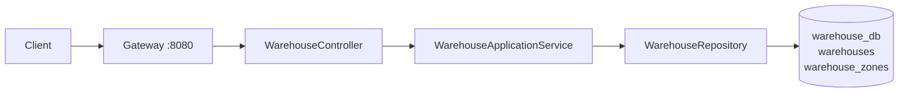

# warehouse-service

## 1. Vai trò

Quản lý kho và khu vực kho: `warehouses`, `warehouse_zones`.



## 2. Thư viện

WebMVC, Validation, Security, OAuth2 Resource Server/JOSE, JPA, PostgreSQL, Flyway, Actuator, Test.

## 3. Source hiện tại

```text
warehouse-service/
├── pom.xml
└── src/main
    ├── java/com/wms/warehouse
    │   ├── WarehouseApplication.java
    │   └── SecurityConfig.java
    └── resources
        ├── application.yml
        └── db/migration/V1__schema.sql
```

Cấu trúc nghiệp vụ mục tiêu:

```text
com.wms.warehouse
├── controller/
├── dto/
├── service/
├── repository/
├── entity/
└── exception/
```

## 4. API mục tiêu

```text
GET    /api/warehouses
GET    /api/warehouses/{id}
POST   /api/warehouses
PUT    /api/warehouses/{id}
DELETE /api/warehouses/{id}

GET    /api/warehouse-zones
POST   /api/warehouse-zones
PUT    /api/warehouse-zones/{id}
```

Chưa implement controller trong source hiện tại.

## 5. Cách code

Một request tạo zone:

```text
WarehouseZoneController.create
 -> DTO validation
 -> WarehouseZoneService
 -> kiểm tra warehouse tồn tại
 -> WarehouseZoneRepository.save
 -> DB
 -> Response DTO
```

Không gọi `warehouse_db` từ Inventory Service. Inventory chỉ giữ `warehouse_id` và gọi Warehouse Service khi cần dữ liệu chi tiết.

## 6. Demo flow

```http
POST http://localhost:8080/api/warehouses
Authorization: Bearer <JWT>
Content-Type: application/json

{
  "code": "WH-HCM-01",
  "name": "Kho HCM"
}
```

```text
Client -> Gateway -> WarehouseController
       -> WarehouseApplicationService
       -> WarehouseRepository
       -> warehouse_db
       -> JSON response
```

## 7. Cách code tạo Warehouse và Zone

Migration hiện dùng `BIGSERIAL`; `warehouse_zones.warehouse_id` là `BIGINT` và unique theo cặp `(warehouse_id, code)`. Migration chưa có FK vật lý từ zone tới warehouse; service phải kiểm tra kho tồn tại, hoặc thêm constraint bằng migration nếu hai bảng tiếp tục cùng một DB.

### Request DTO

```java
public record CreateWarehouseRequest(
    @NotBlank @Size(max = 50) String code,
    @NotBlank @Size(max = 255) String name,
    @Size(max = 255) String location,
    @Size(max = 500) String address
) {}

public record CreateZoneRequest(
    @NotBlank @Size(max = 50) String code,
    @NotBlank @Size(max = 150) String name
) {}
```

### Repository và service

```java
public interface WarehouseRepository extends JpaRepository<WarehouseEntity, Long> {
  boolean existsByCode(String code);
}

public interface WarehouseZoneRepository extends JpaRepository<WarehouseZoneEntity, Long> {
  boolean existsByWarehouseIdAndCode(Long warehouseId, String code);
  List<WarehouseZoneEntity> findByWarehouseIdOrderByCode(Long warehouseId);
}
```

```java
@Transactional
public WarehouseResponse create(CreateWarehouseRequest request) {
  String code = request.code().trim();
  if (warehouses.existsByCode(code)) {
    throw new ApiException(HttpStatus.CONFLICT, "Warehouse code already exists");
  }
  WarehouseEntity entity = new WarehouseEntity(
      code, request.name().trim(), request.location(), request.address());
  return WarehouseResponse.from(warehouses.save(entity));
}

@Transactional
public ZoneResponse createZone(Long warehouseId, CreateZoneRequest request) {
  WarehouseEntity warehouse = warehouses.findById(warehouseId)
      .orElseThrow(() -> new ApiException(HttpStatus.NOT_FOUND, "Warehouse not found"));
  if (zones.existsByWarehouseIdAndCode(warehouseId, request.code().trim())) {
    throw new ApiException(HttpStatus.CONFLICT, "Zone code already exists in warehouse");
  }
  return ZoneResponse.from(zones.save(new WarehouseZoneEntity(
      warehouse, request.code().trim(), request.name().trim())));
}
```

### Controller và kiểm thử

```java
@PostMapping("/api/warehouses")
public ResponseEntity<WarehouseResponse> create(
    @Valid @RequestBody CreateWarehouseRequest request) {
  return ResponseEntity.status(HttpStatus.CREATED).body(service.create(request));
}

@PostMapping("/api/warehouses/{warehouseId}/zones")
public ResponseEntity<ZoneResponse> createZone(
    @PathVariable Long warehouseId,
    @Valid @RequestBody CreateZoneRequest request) {
  return ResponseEntity.status(HttpStatus.CREATED).body(service.createZone(warehouseId, request));
}
```

Swagger mô tả code/name/location/address và zone `warehouseId`. Test duplicate code -> 409, warehouse không tồn tại -> 404, role sai -> 403. `@Transactional` đặt tại service; không viết kiểm tra nghiệp vụ trong controller.
